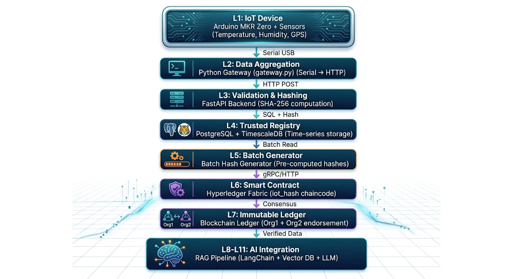

# NanoScript IoT Blockchain System

This document provides a step-by-step installation and configuration guide for a testing environment implementing an IoT data integrity system based on a permissioned blockchain network, integrated with a RAG pipeline and LLM for intelligent data querying.


> This repository provides a complete installation and configuration guide for a testing environment implementing an IoT monitoring system based on a permissioned blockchain network, integrated with a Retrieval-Augmented Generation (RAG) pipeline and a local Large Language Model for intelligent data querying. The system captures real-time environmental data (temperature, humidity, GPS) from an Arduino MKR Zero, validates and hashes every record through a FastAPI backend, anchors cryptographic proofs on a Hyperledger Fabric blockchain requiring dual-organisation endorsement, and exposes all verified data through a natural language chatbot interface powered by LangChain and llama3.2.

---

## Project Overview

This system was built to solve a fundamental problem in IoT deployments: **raw sensor data cannot be trusted by default**. A database administrator, a software bug, or a malicious insider can modify historical readings without leaving any trace. This project addresses that problem by combining three technologies:

- **Arduino MKR Zero + DHT11 + GPS** — physical sensing layer collecting temperature, humidity, and location data
- **Hyperledger Fabric Blockchain** — permissioned ledger that anchors a SHA-256 hash of every sensor record, requiring endorsement from two independent organisations before any data is written
- **RAG Pipeline (LangChain + ChromaDB + llama3.2)** — AI layer that makes blockchain-verified data queryable through natural language

Any tampering with a stored record produces a hash mismatch detectable by the `verifyIntegrity` chaincode function, providing a cryptographic guarantee of data integrity from sensor to storage.


Any tampering with a stored record produces a hash mismatch detectable by the `verifyIntegrity` chaincode function, providing a cryptographic guarantee of data integrity from sensor to storage.


## Table of Contents

1. [Project Overview](#project-overview)
2. [System Architecture](#system-architecture)
3. [Hardware Requirements](#hardware-requirements)
4. [Software Stack](#software-stack)
5. [Installation Guide](#installation-guide)
6. [Layer-by-Layer Validation](#layer-by-layer-validation)


---

## System Architecture


---

## Hardware Requirements

### Required Components

| Component | Model | Purpose | Connection |
|-----------|-------|---------|------------|
| Microcontroller | Arduino MKR Zero | Main processing unit | USB to PC |
| Temperature/Humidity | DHT11 | Environmental sensing | Pin A1 |
| GPS Module | MKR GPS Shield | Location tracking | UART (Pins 13/14) |
| USB Cable | Micro-USB | Power + Data | USB port |

### Pin Connections

**DHT11 Sensor:**
- VCC → VCC (3.3V)
- GND → GND
- DATA → A1

**GPS Shield:**
- VCC → VCC
- GND → GND
- TX → RX1 (Pin 14)
- RX → TX1 (Pin 13)


---

## Software Stack

### Core Technologies

| Layer | Technology | Version | Purpose |
|-------|-----------|---------|---------|
| L1 | Arduino C++ | - | Sensor reading |
| L2 | Python 3.10 | 3.10.x | Gateway script |
| L3 | FastAPI | 0.110.x | REST API |
| L3 | Pydantic | 2.6.x | Data validation |
| L4 | PostgreSQL | 17.x | Relational DB |
| L4 | TimescaleDB | 2.26.x | Time-series |
| L5 | Python | 3.10.x | Batch processing |
| L6 | Hyperledger Fabric | 2.5.15 | Blockchain |
| L6 | Go (Chaincode) | 1.21.x | Smart contracts |
| L7 | Docker | Latest | Containerization |
| L8-11 | LangChain | Latest | RAG pipeline |
| L8-11 | OpenAI | GPT-3.5 | LLM processing |


---

## Installation Guide

### Prerequisites

```bash
brew install postgresql@17
brew install timescaledb
brew install docker
brew install git

python3.10 -m venv venv
source venv/bin/activate
pip install fastapi uvicorn psycopg2-binary pydantic

⛓️ Hyperledger Fabric Installation Guide
This guide details the step-by-step process for installing a permissioned blockchain environment to support the NanoScript-IoT-Blockchain framework.

1. System Prerequisites
Hyperledger Fabric requires several underlying technologies. Run the following commands to ensure your environment is ready:

Docker & Docker Compose: To host the blockchain nodes (Peers, Orderers, CAs).

Node.js (v18.x): Required for the JavaScript chaincode execution.

Python (3.10+): Required for the FastAPI backend and RAG gateway.

Bash
# For macOS (Using Homebrew)
brew install git curl node@18 python@3.10 docker docker-compose
2. Install Fabric Binaries and Docker Images
This project is optimized for Hyperledger Fabric v2.5.4 (LTS). Execute the official bootstrap script to download the Fabric samples, the required binaries (peer, orderer, configtxgen), and the official Docker images:

Bash
# Downloads binaries and Docker images for version 2.5.4
curl -sSL https://bit.ly/2ysbOFE | bash -s -- 2.5.4 1.5.7
3. Environment Configuration
Add the downloaded binaries to your system's PATH and define the configuration path so the system can locate the peer CLI:

Bash
# Add these lines to your ~/.zshrc or ~/.bashrc
export PATH=$PWD/bin:$PATH
export FABRIC_CFG_PATH=$PWD/config/
4. Smart Contract (Chaincode) Dependencies
Since the project uses Node.js for the Smart Contract (iot_hash.js), you must install the Fabric Contract SDK dependencies before deployment:

Bash
cd chaincode/src
npm install⛓️ Hyperledger Fabric Installation Guide
This guide details the step-by-step process for installing a permissioned blockchain environment to support the NanoScript-IoT-Blockchain framework.

1. System Prerequisites
Hyperledger Fabric requires several underlying technologies. Run the following commands to ensure your environment is ready:

Docker & Docker Compose: To host the blockchain nodes (Peers, Orderers, CAs).

Node.js (v18.x): Required for the JavaScript chaincode execution.

Python (3.10+): Required for the FastAPI backend and RAG gateway.

Bash
# For macOS (Using Homebrew)
brew install git curl node@18 python@3.10 docker docker-compose
2. Install Fabric Binaries and Docker Images
This project is optimized for Hyperledger Fabric v2.5.4 (LTS). Execute the official bootstrap script to download the Fabric samples, the required binaries (peer, orderer, configtxgen), and the official Docker images:

Bash
# Downloads binaries and Docker images for version 2.5.4
curl -sSL https://bit.ly/2ysbOFE | bash -s -- 2.5.4 1.5.7
3. Environment Configuration
Add the downloaded binaries to your system's PATH and define the configuration path so the system can locate the peer CLI:

Bash
# Add these lines to your ~/.zshrc or ~/.bashrc
export PATH=$PWD/bin:$PATH
export FABRIC_CFG_PATH=$PWD/config/
4. Smart Contract (Chaincode) Dependencies
Since the project uses Node.js for the Smart Contract (iot_hash.js), you must install the Fabric Contract SDK dependencies before deployment:

Bash
cd chaincode/src
npm install
cd ../..
cd ../..

---

## Layer-by-Layer Validation

This section provides a step-by-step validation process for each layer of the system. It ensures that every component works correctly in isolation before running the full pipeline.

---

## L1 — IoT Device Validation (Arduino + Sensors)

### Objective
Verify that the Arduino correctly reads sensor data and outputs valid JSON.

### Steps
1. Connect the Arduino via USB  
2. Open Arduino Serial Monitor  
3. Set baud rate to 9600  

### Expected Output
```json
{"type":"temperature","value":24.5}
{"type":"humidity","value":60}
{"type":"gps","gps_fix":false,"lat":null,"lon":null}
Validation Checks
Data updates every ~2 seconds
No malformed JSON
GPS:
gps_fix: false indoors
gps_fix: true outdoors
L2 — Gateway Validation (gateway.py)
Objective

Ensure data is correctly sent from serial to FastAPI backend.

Steps
python gateway.py
Expected Behavior
JSON printed in console
HTTP POST sent to backend
Retry works if backend is down
L3 — FastAPI Backend Validation
Objective

Confirm API receives data and hashes it correctly.

Steps
uvicorn main:app --reload

Test:

curl -X POST http://localhost:8000/data \
-H "Content-Type: application/json" \
-d '{"type":"temperature","value":25}'
Expected
200 OK response
Data stored with SHA-256 hash
L4 — Database Validation (PostgreSQL + TimescaleDB)
Objective

Verify data storage.

Query
SELECT * FROM sensor_data ORDER BY time DESC LIMIT 5;
Expected
Timestamp
Sensor values
Hash
blockchain_tx = NULL
L5 — Batch Generator Validation
Objective

Ensure unconfirmed records are retrieved.

Test
curl http://localhost:8000/batch/unconfirmed
Expected
[
  {
    "id": 123,
    "hash": "abc123...",
    "recomputed": false
  }
]
L6 — Chaincode Validation (Hyperledger Fabric)
Objective

Verify blockchain logic.

Steps
peer chaincode invoke ...
peer chaincode query ...
Expected
Endorsed by Org1 and Org2
Hash stored successfully
L7 — Blockchain Ledger Validation
Objective

Ensure immutability.

Test
peer chaincode query -C mychannel -n iot -c '{"Args":["queryHash","abc123"]}'
Expected
Valid transaction
Same result across peers
L8 — Vector Database Validation (ChromaDB)
Objective

Verify embeddings.

Expected
~1000 documents
Each contains sensor + hash
L9 — LangChain Validation
Test Query

"What is the weather like?"

Expected
Relevant sensor data retrieved
L10 — LLM Validation (Ollama)
Test
ollama run llama3.2
Expected
Grounded answers
No hallucination
L11 — Streamlit Interface Validation
Run
streamlit run app.py
Expected
Chat interface loads
Answers + raw data visible
Final Validation

If all layers pass:

Data flows end-to-end
Blockchain verification works
AI responses are accurate
